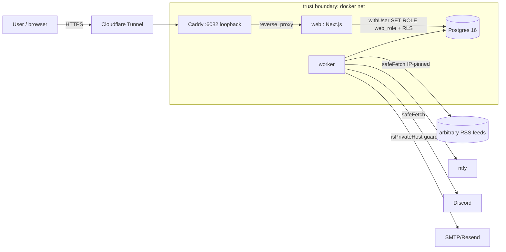
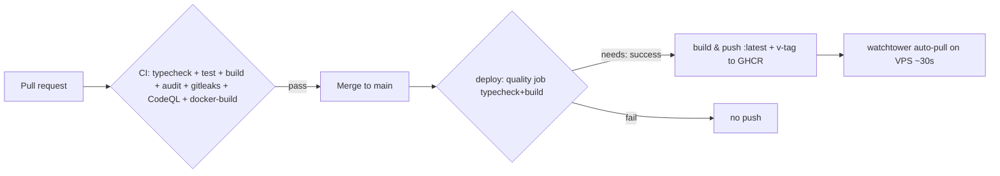
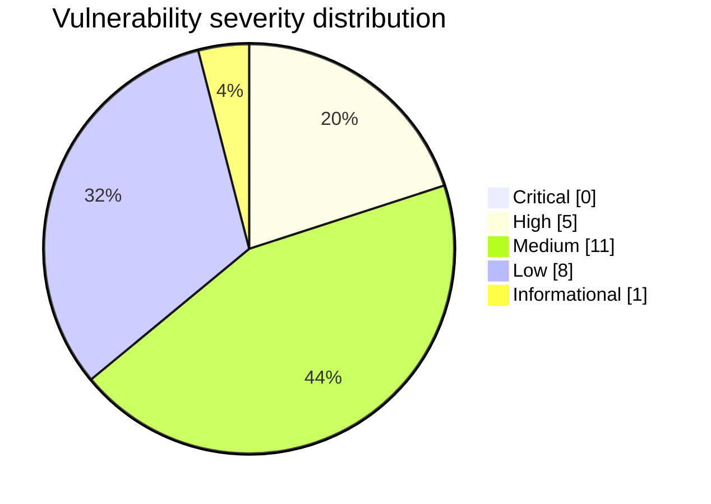

# Security Review Report — simple-rss-notifications

- **Repo:** `jason-tucker/simple-rss-notifications`
- **Reviewed at commit:** `17ca4a5` (v0.14.0)
- **Remediation branch:** `claude/beautiful-keller-6v9vrj` (→ v0.15.0)
- **Date:** 2026-06-09
- **Reviewer:** automated multi-agent security swarm (5 read-only review agents → 8 file-disjoint remediation units → integrated + e2e-verified)
- **Overall residual risk:** **Low–Medium** (down from High). The two systemic High issues — unenforced session revocation and a bypassable SSRF guard — are fixed and runtime-verified. Remaining items are Low/forward-looking and documented.
- **Safe to deploy?** Yes to **staging / as a PR** (all gates pass: typecheck, build, 8 unit tests, full runtime e2e). Production deploy is left to the maintainer (watchtower auto-pulls `:latest` on merge to `main`); do not merge until you've reviewed the diff and rotated any existing `admin` bootstrap password.

## Executive summary

The app is a self-hosted, multi-user RSS→notification bridge (Next.js 15 App Router, Drizzle + Postgres RLS, jose JWT, argon2id, nodemailer; Caddy + Cloudflare Tunnel ingress; worker polls feeds and fans out to SMTP/Resend/ntfy/Discord). It fetches arbitrary user-supplied URLs and stores third-party secrets encrypted with AES-256-GCM.

The codebase is, on the whole, **well-architected and security-aware** — RLS is correct and fails closed, JWT verification is alg-pinned, AES-GCM usage is correct, argon2id params meet OWASP, and there are no committed secrets. The serious problems were **gaps between intent and wiring**: a hardened `withAuth()` wrapper that was never actually called by any route, and an SSRF guard that validated the URL but not the connection it actually made.

### Biggest issues fixed
1. **Session revocation was a no-op on the entire JSON API** (High) — `withAuth()` existed but no data route used it; logout/password-change didn't invalidate live tokens. Now wired everywhere and **verified at runtime** (revoked cookie → `401 session-revoked`).
2. **SSRF guard fully bypassable** (High) — DNS rebinding/TOCTOU (resolve ≠ connect) and unre-validated redirects. Replaced with a connection-pinning `safeFetch()` that re-validates every redirect hop; verified internal-IP feeds are rejected.
3. **Default admin credentials `tucker`/`admin`** (High) — could be shipped to the internet. Default removed; weak/`admin` password now refuses to seed.
4. **Deploy pushed `:latest` to prod with no test gate** (High) — now gated on typecheck + build.

### Biggest remaining risks (documented, not auto-fixed by decision/scope)
- **Re-auth elevation for secret mutation is not implemented** (Medium) — a hijacked session can overwrite stored SMTP/Resend/Discord/ntfy secrets without re-authentication. Building it is UI-bearing feature work; see Remaining Actions.
- **`drizzle-orm < 0.45.2`** SQL-identifier-injection advisory (1 residual HIGH from `pnpm audit`) — low practical exploitability here (parameterized templates, no `sql.identifier` use); needs its own regression-tested major bump.
- **CSP ships `'unsafe-inline'`** for script/style (Next 15 hydration) — backstop only; nonce-based strict CSP is the follow-up.
- Pure-Low items intentionally deferred (CSRF fail-open on missing Origin+Referer, `x-forwarded-for` trust, `users_self` column-level GRANT for `is_admin`).

## Coverage

| Area | Status | Reason / evidence |
|---|---|---|
| Repo mapping / architecture | ✅ completed | This report; THREAT_MODEL.md |
| Threat modeling | ✅ completed | THREAT_MODEL.md |
| Secrets (tree + git history) | ✅ completed | None found; gitleaks added to CI |
| Dependency / supply chain | ✅ completed | `pnpm audit` 9→1; DEPENDENCY_AND_SBOM_NOTES.md |
| Static AppSec (injection/XSS/SSRF/etc.) | ✅ completed | Findings register below |
| Auth / authz / data isolation | ✅ completed | RLS verified sound; `withAuth` wired; e2e |
| API / backend review | ✅ completed | Per-endpoint review; revocation + rate-limit fixed |
| Frontend security | ✅ completed | Stored-XSS fixed; CSP added |
| AI / LLM / RAG / agent safety | ⛔ not applicable | No AI/LLM/embeddings/agents/model files exist |
| Infra / Docker / IaC | ✅ completed | Container hardening; rule #3 honored |
| CI/CD security | ✅ completed | Deploy gate + scanning + dependabot |
| Testing / QA | ✅ completed | 8 unit tests added; full runtime e2e run |
| Performance / reliability | ◑ partial | SSRF body caps, manual-redirect bounds, timeouts; no load test |
| Database / data safety | ✅ completed | RLS + migrations reviewed; no destructive migration |
| Observability / reliability | ◑ partial | Structured error handling preserved; no new metrics |
| Release management | ✅ completed | Consolidated branch, changelog, rollback plan |

## Findings register

Status legend: ✅ fixed & verified · 🟢 fixed · 📝 documented (deferred by scope/decision) · ℹ️ informational/false-positive-adjacent

| ID | Sev | Conf | Category (CWE) | File/line (evidence) | Impact | Fix | Test | Status |
|---|---|---|---|---|---|---|---|---|
| H1 | High | High | Broken session mgmt (CWE-613) | `lib/auth/withAuth.ts` unused; all `app/api/**` data routes | Logout / password-change / "logout everywhere" did not revoke live JWTs; most routes unthrottled | Wire `withAuth` into 12 routes; fwd Next route ctx | e2e #5 (revoked→401) | ✅ |
| H2 | High | High | SSRF/TOCTOU (CWE-918/367) | `lib/ssrf.ts` resolve vs `fetch` connect | DNS-rebinding to IMDS/internal | `safeFetch` pins connection to validated IP | unit (IP classifier) + e2e #6 | ✅ |
| H3 | High | High | SSRF via redirect (CWE-918) | `rss/fetch.ts:40` `redirect:'follow'` | 302→`169.254.169.254`/`db:5432` | Manual redirect loop, re-validate each hop | unit + e2e #6 | ✅ |
| H4 | High | High | Default creds (CWE-1392/798) | `lib/env.ts:36`; `worker/bootstrap.ts`; `.env.example` | Internet-facing `tucker`/`admin` | Drop default; refuse weak/`admin`; install.sh generates | e2e (strong pw seeds) | ✅ |
| H5 | High | High | Poisoned pipeline (CICD-SEC-1) | `.github/workflows/deploy.yml` | Untested `:latest` auto-deployed | `build-and-push needs: quality` (typecheck+build) | CI (workflow valid) | 🟢 |
| M1 | Med | High | Insecure design / unverified change (CWE-620) | `app/api/sinks/[type]/[id]/route.ts`; no `/api/auth/reauth` | Hijacked session can overwrite stored secrets w/o re-auth | **deferred** (UI feature) | — | 📝 |
| M2 | Med | High | SSRF + error oracle (CWE-918) | `lib/email/send.ts` SMTP connect | Internal port-scan via SMTP test errors | `isPrivateHost()` guard + generic conn error | unit + review | 🟢 |
| M3 | Med | High | SSRF allowlist gap (CWE-918) | `lib/ssrf.ts` IPv6 | NAT64/6to4/hex IPv4-mapped bypass | byte-level IPv6 classifier | unit | ✅ |
| M4 | Med | High | Session mgmt (CWE-613) | `app/api/users/[id]/route.ts` | Admin pw-reset left attacker session live | `DELETE web_sessions` on reset; jti check in `requireAdmin` | review | 🟢 |
| M5 | Med | High | Stored XSS (CWE-79) | `components/ActivityList.tsx`; `rss/parse.ts` | `javascript:` feed link → click XSS | `isSafeHttpUrl` gate at ingest+render | unit + e2e (CSP) | ✅ |
| M6 | Med | High | Missing CSP (CWE-693) | `next.config.mjs` | No injection backstop | baseline CSP added | e2e (header present) | 🟢 |
| M7 | Med | High | Vulnerable deps (CWE-1395) | `web/package.json` (nodemailer) | HIGH addressparser DoS in runtime dep | bump nodemailer→8.0.x etc. | `pnpm audit` 9→1 | 🟢 |
| M8 | Med | High | No CI scanning (CICD-SEC-3) | `.github/workflows/ci.yml` | Vulns/secrets uncaught | audit+gitleaks+CodeQL+dependabot | CI valid | 🟢 |
| M9 | Med | High | Image provenance (CWE-494) | `docker-compose.yml` `:latest` | Unattended deploy, no signing | patch-pinned tags; cosign/digest = follow-up | — | ◑ |
| M10 | Med | High | Base image pinning (CWE-1357) | Dockerfiles | Floating tags | pinned to patch tags | — | ◑ |
| M11 | Med | High | Container hardening (CWE-400/CIS) | `docker-compose.yml` | No limits/caps/healthchecks | mem/cpu limits, cap_drop, no-new-priv, healthchecks | build/compose-config | 🟢 |
| L1 | Low | Med | CSRF fail-open (CWE-352) | `lib/auth/csrf.ts:42-44` | Missing Origin+Referer ⇒ allowed | **deferred** | — | 📝 |
| L2 | Low | Med | Spoofable IP (CWE-348) | `lib/ratelimit.ts` | `x-forwarded-for` fallback | **deferred** (Cloudflare sets `cf-connecting-ip`) | — | 📝 |
| L3 | Low | High | Logic/pagination | `app/api/dispatches/route.ts` | `total` over-counts w/ feed filter | fixed (count mirrors row query) | review | 🟢 |
| L4 | Low | High | Header injection (CWE-93) | `lib/ntfy/publish.ts` | ntfy `Click` from feed link | sanitize+http(s)-gate | review | 🟢 |
| L5 | Low | Med | Resource exhaustion (CWE-400) | ntfy/discord/email | unbounded error-body read | `readCappedText` (8 KiB) | review | 🟢 |
| L6 | Low | Med | Priv mgmt (CWE-269) | `migrations/0001` `users_self` | `web_role` could UPDATE own `is_admin` (no live path) | **deferred** (column GRANT) | — | 📝 |
| L7 | Low | High | Insecure default (CWE-1188) | `worker/bootstrap.ts` | Maintainer email seeded as SMTP sink | **deferred** (incomplete sink, harmless) | — | 📝 |
| L8 | Low | Med | Entropy (CWE-331) | `scripts/install.sh` | non-openssl pw fallback unchecked | **deferred** | — | 📝 |
| INF | Info | — | drizzle-orm < 0.45.2 (GHSA-gpj5-g38j-94v9) | `web/package.json` | SQL-identifier injection (no `sql.identifier` use here) | **deferred** (own regression PR) | — | 📝 |

### Verified false-positives (no action — good design)
RLS multi-tenant isolation (parameterized GUC, fails closed, `WITH CHECK` on every policy, `worker_role` BYPASSRLS isolated from web); no IDOR/BOLA; no mass-assignment; no `dangerouslySetInnerHTML`; no XXE/billion-laughs (hand-rolled parser, no XML lib); no command injection / unsafe deserialization; JWT alg-confusion (`algorithms:['HS512']`); AES-256-GCM (random 12-byte IV, tag verified); argon2id (m=19456,t=2,p=1); no committed secrets (tree + history); no `NEXT_PUBLIC_` secret leakage; `__Host-` cookie flags correct; rule #3 (no host ports) honored.

## Changes made (by group)
- **Auth/session:** `withAuth` wired into 12 data routes + Next route-ctx forwarding; `requireAdmin` jti revocation; admin pw-reset session delete; default-cred removal + bootstrap refusal.
- **SSRF/outbound:** `safeFetch` (IP-pin + manual redirect re-validation + byte-level IPv6), SMTP `isPrivateHost` guard + generic conn error, ntfy `Click` sanitize, capped provider bodies.
- **Frontend:** `isSafeHttpUrl` allowlist at ingest+render; CSP.
- **Dependencies:** nodemailer/esbuild/next/postcss bumps; `pnpm audit` 9→1.
- **CI/CD:** deploy quality gate; audit/gitleaks/CodeQL jobs; dependabot.
- **Infra:** container limits/caps/healthchecks; patch-pinned images.
- **Tests:** 8 `node:test` unit tests + `pnpm test` script wired into CI.

## Tests run
See TEST_RESULTS.md. Summary: `pnpm typecheck` ✅, `pnpm test` ✅ (8/8), `pnpm build` ✅, full runtime e2e (Postgres + migrate + start + curl) ✅ — session-revocation, SSRF, CSRF, CSP, rate-limit (429), default-cred seeding all verified.

## Deployment status
**Not deployed.** Delivered as one consolidated PR for review (per maintainer decision). Production is gated behind merge-to-`main` (watchtower auto-pull). See DEPLOYMENT_AND_ROLLBACK.md.

## Remaining manual actions
1. **Rotate any existing `admin` bootstrap password** — deployments already seeded on `tucker`/`admin` are NOT auto-remediated (bootstrap marker already set).
2. **Enable branch protection on `main`** requiring the CI checks (the workflow gate blocks the deploy push, not the merge).
3. **Configure `BOOTSTRAP_PASSWORD`** on fresh installs (install.sh now generates one).
4. **Decide on the re-auth elevation feature** (M1) — recommended before exposing multi-user.
5. **Schedule the `drizzle-orm ≥ 0.45.2` bump** (INF) with regression testing.
6. **CodeQL/gitleaks surfacing** needs GitHub Advanced Security on a private repo.
7. Optional Low follow-ups: CSRF fail-closed (L1), drop `x-forwarded-for` trust (L2), `users` column-level GRANT (L6), remove seeded maintainer SMTP sink (L7), install.sh entropy assertion (L8), nonce-based strict CSP, SHA-pin existing actions, image digest pinning + cosign (M9/M10).

## Diagrams

### System / data-flow

### Deployment pipeline (after H5/M8 fixes)

### Severity distribution

